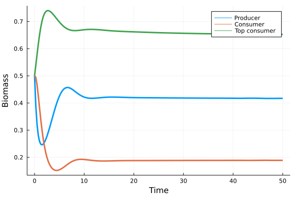

# BioenergeticFoodwebs.jl


[](http://codecov.io/github/BecksLab/BEFWM2.jl?branch=main)

BioenergeticFoodwebs is a Julia package that implements the bioenergetic
consumer-resource model from [Yodzis and Innès (1992)][Yodzis1992] adapted to foodwebs
(see [Williams et al., 2008][Williams2008] for more details).

[Yodzis1992]: https://www.journals.uchicago.edu/doi/abs/10.1086/285380
[Williams2008]: https://link.springer.com/chapter/10.1007/978-1-4020-5337-5_2

Expected features on top of the core model:
- [ ] various models for basal species growth, including a nutrient uptake function
- [ ] 3 different adaptive rewiring methods of trophic interactions following extinctions or
    changes in species biomass
- [ ] models accounting for temperature effect on species mass or on biological rates
- [ ] choice of different functional response (linear, classic and bioenergetic)
- [ ] measuring system stability according to several metrics

## Install the package

From the Julia REPL package mode (accessed with `]`), run:

```julia
add BioenergeticFoodwebs
```

To use BioenergeticFoodwebs.jl at its full potential you probably want to install
[EcologicalNetworks.jl](http://docs.ecojulia.org/EcologicalNetworks.jl/stable/):

```julia
add EcologicalNetworks
```

## First simulation

We describe below the most straightforward way to run a simulation with
BioenergeticFoodwebs.jl to illustrate the overall workflow. You will find more details and
more elaborated examples in the package [Documentation](https://docs-url).

### Set up

```julia
using BioenergeticFoodwebs
using EcologicalNetworks
```


### Generate a foodweb

The first step is to generate the foodweb. For instance, the foodweb can be generated from
an adjacency matrix with the `FoodWeb` method.

```julia
A = [0 0 0; 1 0 0; 0 1 0] # 1 producer ⋅ 2 eats 1 ⋅ 3 eats 2
foodweb = FoodWeb(A)
```

The foodweb can also be generated using structural models from EcologicalNetworks.jl, see
[Documentation - Foodwebs](https://docs-url/foodwebs).

### Generate the model parameters

Once the foodweb is created, the next step is to attribute values to the model parameters.
This can be simply done by calling the method `ModelParameters` with `foodweb` as an
argument.

```julia
params = ModelParameters(foodweb)
```

You can see that the model parameters are stored in different objects (`FoodWeb`,
`BioRates`, `Environment` and `FunctionalResponse`) depending on their nature. For instance,
`Environment` stores environmental variables. Each of these objects can be customized to
suit your needs, see [Documentation - Model Parameters](https://docs-url/modelparameters).

### Simulate biomass dynamics

Everything is ready to run the simulation, which can be simply done by calling `simulate`
with the model parameters (`params`) and species initial biomass (`B0`).

```julia
B0 = [0.5, 0.5, 0.5]
sim = simulate(params, B0)
```

The `simulate` function is obviously doing lot of work under the hood, to learn how it works
see [Documentation - Simulation](https://docs-url/simulation).

### Plot biomass trajectories

Eventually you may want to plot the trajectory of your community to *see* what is happening.
For our minimal example, it can be done as follow:

```julia
using Plots
t, B1, B2, B3 = sim.t, sim.B[:,1], sim.B[:,2], sim.B[:,3]; # unpack variables
plot(t, B1, lw = 3, label="Producer", xlabel = "Time", ylabel = "Biomass")
plot!(t, B2, lw = 3, label="Consumer")
plot!(t, B3, lw = 3, label="Top consumer")
```



To perform further analysis, especially about the system stability, see
[Documentation - Stability](https://docs-url/stability).
